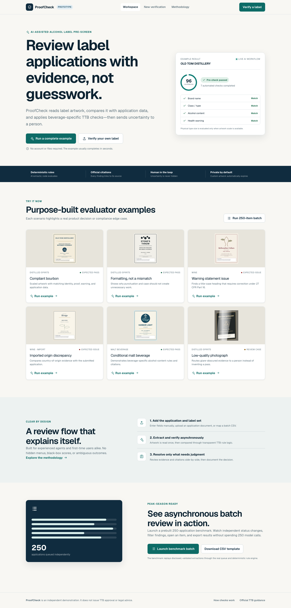
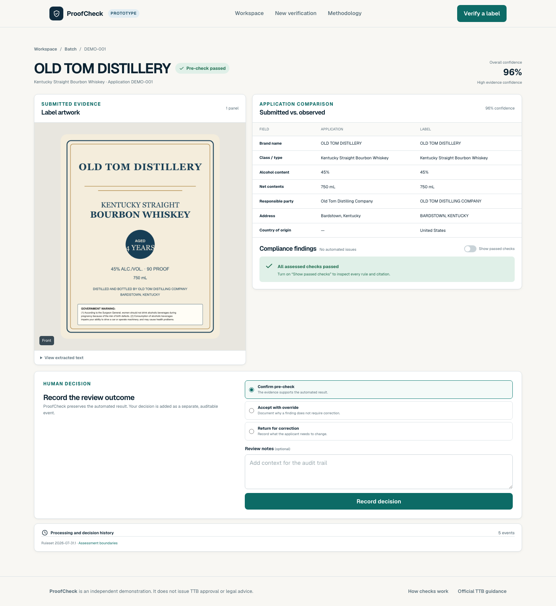
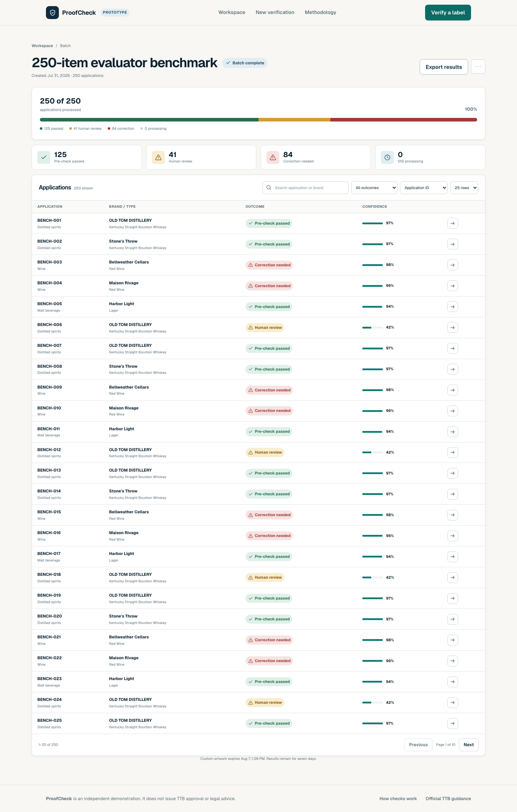

# ProofCheck

ProofCheck is an AI-assisted alcohol label pre-screening prototype. It extracts evidence from complete label artwork, compares that evidence with application facts, applies a versioned catalog of beverage-specific rules, and routes uncertainty to a human reviewer.

**[Open the public prototype](https://treasury-label-verifier-dusky.vercel.app)** · **[View the source repository](https://github.com/ilan0/treasury-label-verifier)**

The product is designed as a standalone demonstration for the Alcohol and Tobacco Tax and Trade Bureau (TTB) workflow. It never claims that a label is “TTB approved.” Outcomes are intentionally limited to **pre-check passed**, **human review required**, and **correction needed**.

## User quick start

No account, application data, or artwork is needed:

1. Open the dashboard.
2. Select **Run a complete example** for a live AI extraction, or choose one of six focused scenarios.
3. Select **Run 250-item batch** to exercise the durable batch pipeline without making 250 unnecessary model calls.

Custom manual applications, application-document extraction, private artwork uploads, and CSV batches of up to 300 applications are also supported.



<details>
<summary>View the evidence review and 250-item batch screens</summary>





</details>

## Why the architecture is split this way

```text
Browser
  └─ Next.js route handlers (validation, session authorization, signed uploads)
       ├─ Supabase Postgres (jobs, evidence, findings, decisions, outbox)
       ├─ Supabase private Storage (application and artwork artifacts)
       └─ Inngest durable functions
            ├─ OpenAI structured vision/document extraction
            ├─ deterministic matching and TTB rules
            └─ retries, recovery, status history, and expiry cleanup
```

- **OpenAI extracts; code evaluates.** Model output is untrusted structured evidence. It never makes the legal decision.
- **Postgres is the source of truth.** Every asynchronous transition and finding is persisted, so progress survives refreshes, worker retries, and deployments.
- **One durable event per application.** A failed label does not fail its batch. Global worker concurrency is five.
- **Anonymous but isolated.** A signed HttpOnly user cookie owns every record. Server-side data access always includes the session identifier; direct anonymous database access is revoked.
- **Private, expiring artifacts.** Browser uploads use short-lived signed targets in a private bucket. Custom artifacts expire after 24 hours and structured results after seven days.
- **Deterministic uncertainty.** Clear mandatory discrepancies require correction. Low-confidence, unreadable, jurisdiction-sensitive, or physically unmeasurable evidence goes to a person.

## Technology

- Next.js 16 App Router, React 19, TypeScript, and Tailwind CSS 4
- Supabase Postgres and private Storage, Drizzle ORM and SQL migrations
- Inngest durable functions with transactional outbox recovery
- OpenAI Responses API with GPT-5.6 Luna and Zod structured output
- Vitest, Testing Library, Playwright, and axe-core
- Vercel deployment and GitHub Actions CI

## Regulatory scope

Ruleset `2026-07-31.1` covers:

- Distilled spirits under 27 CFR Parts 5 and 16
- FAA wine under 27 CFR Parts 4 and 16
- Malt beverages under 27 CFR Parts 7 and 16
- Sub-7% wine and non-FAA beer jurisdiction routing
- Ambiguous fermented products routed to classification review

Common checks include brand, class/type, alcohol content and proof, net contents, responsible party, imported origin, the exact government health warning, qualifying panel placement, and declared beverage-specific disclosures. Every visible finding stores its expected and observed evidence, assessment status, explanation, confidence, and official citation.

Physical type size cannot be proven from an unscaled bottle photograph. Specialized claims, formula/production facts, state law, and FDA-only analysis are explicitly shown as **not assessed** rather than silently passed. This prototype does not issue a Certificate of Label Approval or replace qualified legal review.

Authoritative references are linked on the in-product methodology page and include current [27 CFR Part 4](https://www.ecfr.gov/current/title-27/chapter-I/subchapter-A/part-4), [Part 5](https://www.ecfr.gov/current/title-27/chapter-I/subchapter-A/part-5), [Part 7](https://www.ecfr.gov/current/title-27/chapter-I/subchapter-A/part-7), [Part 16](https://www.ecfr.gov/current/title-27/chapter-I/subchapter-A/part-16), and TTB beverage-specific guidance.

## Local setup

### Prerequisites

- Node.js 20 or later and npm
- A Supabase project with a direct or pooler Postgres connection string
- An OpenAI project API key with access to the configured vision-capable model
- An Inngest account for deployed execution; the bundled dev server is used locally

### Install and configure

```bash
git clone https://github.com/ilan0/treasury-label-verifier.git
cd treasury-label-verifier
npm ci
cp .env.example .env.local
```

Populate `.env.local` with your own values. Generate the two application-only secrets with, for example, `openssl rand -base64 32`.

| Variable                                    | Exposure and purpose                                            |
| ------------------------------------------- | --------------------------------------------------------------- |
| `NEXT_PUBLIC_APP_URL`                       | Public canonical origin; `http://localhost:3000` locally        |
| `OPENAI_API_KEY`, `OPENAI_MODEL`            | Server-only extraction credentials and model                    |
| `NEXT_PUBLIC_SUPABASE_URL`                  | Public Supabase project URL                                     |
| `NEXT_PUBLIC_SUPABASE_PUBLISHABLE_KEY`      | Public browser-safe project key                                 |
| `SUPABASE_SECRET_KEY`                       | Server-only Storage/database administration key                 |
| `SUPABASE_PROJECT_REF`, `DATABASE_URL`      | Server-only migration and Postgres connection values            |
| `INNGEST_SIGNING_KEY`, `INNGEST_EVENT_KEY`  | Server-only deployed worker authentication                      |
| `SESSION_SIGNING_SECRET`, `RATE_LIMIT_SALT` | Server-only random application secrets                          |
| Retention/quota variables                   | Optional limits documented with safe defaults in `.env.example` |

Never prefix a server credential with `NEXT_PUBLIC_`. GitHub and Vercel access tokens are deployment credentials, not application environment variables.

### Initialize the data layer

```bash
npm run db:migrate
npm run db:seed
npm run db:check
```

`db:migrate` applies the idempotent SQL schema, revokes direct anonymous table access, and creates/configures the private `label-artifacts` Storage bucket. `db:seed` verifies that the current ruleset is loadable; built-in example assets remain version-controlled and do not create permanent user records.

### Run locally

Use two terminals:

```bash
npm run dev
```

```bash
npm run dev:inngest
```

Then open [http://localhost:3000](http://localhost:3000). The Inngest dev UI is available at [http://localhost:8288](http://localhost:8288).

## Submission modes

- **Manual:** enter profile-aware application facts, add all applicable label panels, and submit.
- **Application document:** upload a PDF, image, Word document, or text file; review and confirm the editable extracted draft before adding artwork.
- **Batch:** download `public/sample-batch.csv`, map one or more panel files to each repeated `application_id`, correct the aggregated validation report, and submit up to 300 applications/600 files.
- **Built-in examples:** individual scenarios perform live OpenAI extraction. The disclosed 250-item benchmark replays versioned, pre-validated extraction fixtures through the same real Inngest queue, persistence layer, matching code, and rules engine.

Accepted artwork is JPG, PNG, WebP, or PDF, up to 10 MB per artifact and 300 MB per batch. Remote URL ingestion is deliberately excluded. Extensions are not trusted; content signatures and decoding are verified server-side.

## Verification commands

```bash
npm run format:check
npm run lint
npm run typecheck
npm run test:coverage
npm run test:db
npm run test:integration
npm run test:e2e
npm run test:a11y
npm run build
npm audit --omit=dev
npm audit
npm run check:secrets
```

The normal end-to-end suite exercises desktop, mobile, tablet, and wide-desktop views. Release-only real-provider and 250-item checks are opt-in:

```bash
PROOFCHECK_LIVE_E2E=1 npm run test:e2e
PROOFCHECK_REVIEW_E2E=1 npm run test:e2e
PROOFCHECK_BATCH_E2E=1 npm run test:e2e
```

Run release checks only with the Next.js app and Inngest dev server active, or against a configured production base URL. Exact final results and tested workflows are recorded in `TEST_REPORT.md`; implementation decisions and resolved defects remain in `PLAN.md`.

## Security and reliability notes

- Zod validates all route and provider input; uploaded bytes are verified and normalized before model use.
- Mutation routes enforce same-origin requests, server-side session ownership, quota consumption, and idempotency where repeated submission is possible.
- Artwork text is explicitly treated as untrusted prompt data. Raw provider errors, credentials, cookies, and full documents are never returned to the browser or deliberately logged.
- A transactional outbox prevents committed jobs from being lost if queue delivery is interrupted. Scheduled recovery safely claims stale/failed rows with `SKIP LOCKED`.
- Provider calls have a 20-second timeout, one SDK retry, durable retries for recoverable errors, and immediate terminal classification for permanent 4xx failures.
- CSP, HSTS in production, frame denial, MIME-sniffing protection, strict referrer behavior, and a restrictive permissions policy are applied globally.

## Tradeoffs and future production work

This is intentionally one maintainable Next.js deployment rather than a microservice demonstration. Polling is visibility-aware and authoritative; production identity integration or Supabase Realtime could be introduced when an agency authentication model exists. A production procurement would also require formal legal validation of the rules catalog, FedRAMP-authorized service selection, accessibility certification, agency retention/audit integration, calibrated extraction evaluation on representative labels, and a firewall-compatible deployment topology.

See `TEST_REPORT.md` for release evidence and `PLAN.md` for the living implementation record.
